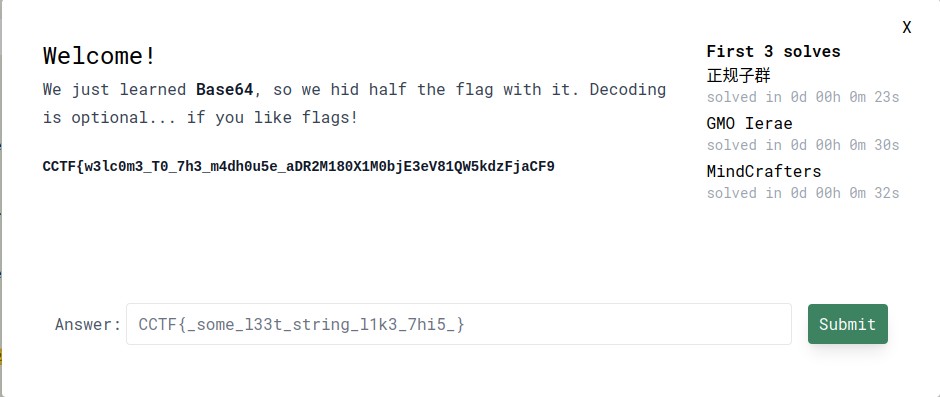

# CRYPTO CTF

flag : CCTF{w3lc0m3_T0_7h3_m4dh0u5e_h4v3_4_S4n17y_5Andw1ch!}

# **BOROCTF**

OSINT 

flag : boroCTF{Bruce_Springsteen}

flag : boroCTF{Nightmare_Eclipse}

flag : boroCTF{Edward_Marvin_Cooper_6'8"_Diedrich_Utah}

flag : BoroCTF{|DeV1RTU0S0|x}

CRYPTO

[chal.txt](chal.txt)

new encoding is base91. 

flag : boroCTF{B@5ics_0f_B@si6s}

Caesar cipher with 3 shift.

flag : boroCTF{@fr13ndn0mor3}

each byte was xor’ed with FF. xor’ing it again returns the plaintext.

flag : boroCTF{th1$_is_n0t_not_th3_fl@g}